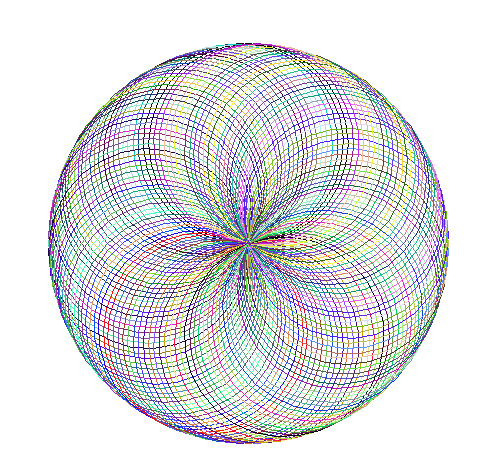

# spirography
working with turtle graphics
Uses random colors to draw circles at a different tilt angle in order to create the beautiful spirograph.
you can change the gap size in the draw_spiral function by passing the gap size as argument.

The radius of the circle is 100

